# Domain Driven Design

## 1. Fuentes de referencia

Libros interesantes

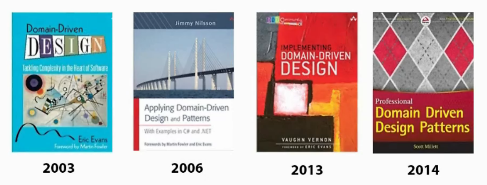

Video resumen de codely:

https://www.youtube.com/watch?v=dH5aSQLXtKg

## 2. DDD en términos generales

Es un enfoque de desarrollo propuesto por Eric Evans.

## 3. Ventajas

- Flexible
- Perspectiva desde la parte del cliente
- Ofrece una vía para solucionar problemas muy complejos
- Permite tener el código bien organizado y fácilmente testable
- Permite tener la lógica de negocio en un único sitio
- Soporta multiples patrones de diseño

## 4. Inconvenientes

- Tiempo y esfuerzo:

    * Require discutir el modelo del problema con los expertos del dominio
    * Aisla la lógica de dominio de otras partes de la aplicación

- Curva de aprendizaje

    * Supone nuevos principios
    * Supone nuevos patrones
    * Supone nuevos procesos

- Sólo tiene sentido cuando realmente el problema tiene complejidad

    * No aconsejado para aplicaciones CRUD o Data-driven
    * No aconsejado cuando sólo hay realmente dificultad técnica no del dominio del problema.

- La compañia o el equipo han de apoyar realmente en el DDD

## 5. Tactical Design

__Model-Driven Design__:

Modelar el diseño en base al contexto del problema genérico. Este modelado estará basado en __Services__, __Entities__, __Value Objects__ (no tienen identificadores, por ejemplo los colores)

Los __Entities__ se pueden agrupar en __Aggregates__ para mantener su integridad.
Los __Value Objects__ se encapsulan en __Aggregates__

Los __Aggregates__ y __Entities__ se pueden guardar en __Repositories__

Cada vez que las __Entities__ cambian de estado, se produce un __Domain Event__
También puede haber eventos de dominio (desde el __Model-Driven Design)

Tanto __Entities__, como __Value Objects__ o __Aggregates__ se pueden encapsular por medio de __Factories__

Todo se combina con la __Layered-Architecture__, (no confundir con la arquitectura por capas, que acopla la base de datos al dominio). Eric Evans que lo quiere decir es que una solución DDD no se acopla a los detalles de implementación. Se usaría Arquitectura Hexagonal o bien Clean Architecture también parece aplicar.

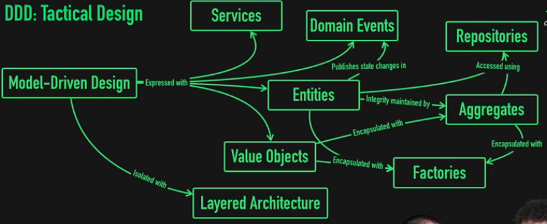

## 6. Strategic Design

Todo esto da estructura al __Ubiquous Language__, que viene a ser un lenguaje que usan los expertos del dominio y los desarrolladores para discutir los términos del sistema.

El espacio del problema se divide en subdominios, mientras que el espacio de la solución a ese problema, se divide en los __Bounded Context__

Finalmente, todo queda reflejado en el __Bounded Context__, que consiste en que un dominio puede dividirse en subdominios, de tal forma que pueden existir dominios relacionados los cuales se agrupan en un contexto. Las fronteras de estos contextos __Context Boundaries__ son los puntos por los cuales se pueden comunicar los subdominios de un contexto con otro. Esta comunicación se hace mediante servicios o adapters.

El modelo se mantiene unificado gracias a la __Continuos Integration__

Las relaciones se mantienen mediante el __Context Map__

Una aplicación anterior (legacy) se conocería como __Big Ball of Mud__

Se define un mecanismo para comunicarnos con otro sistema llamado __Anticorruption Layer__

Los equipos son libres de trabajar de forma separada (__Separate Ways__)

Podemos ofrecer al resto de la empresa una forma de comunicarse con nuestra nueva aplicación, via __Open Host Service__, por ejemplo un API.

Se conoce como __Published Language__ al código publicado

__Shared Kernel__ se conoce como una base de datos compartida entre varios contextos, lo más pequeña posible. Por ejemplo sólo los identificadores a nivel de infraestructura, o bien un servicio de autenticación de usuarios.

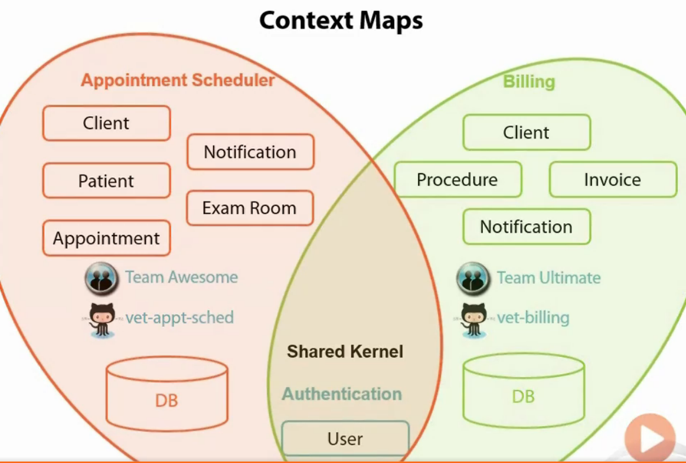

Si tenemos un tercero que nos desarrolla una parte del sistema se conoce como __Customer/Supplier Teams__

__Conformist__ se refiere a que entre dos equipos se tienen que conformar con un api o algo similar para compartir datos.

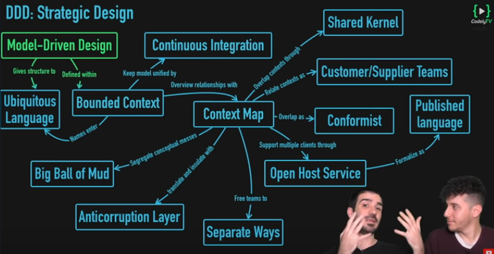

## 7. Anemic Domain Models vs Rich Domain Models

Un modelo de dominio anémico está centrado en el estado, y no el comportamiento. Es la antítesis de lo que se pretende construcir con un Rich Domain Model en DDD.

Un Modelo anémico se puede emplear para un simple CRUD, mientras que el modelo rico encaja perfectamente con el modelo DDD.

## 8. Uni-Directional Associations

Se recomienda usar relaciones unidireccionales, en lugar de bidireccionales por simplicidad y facilitar el mantenimiento.

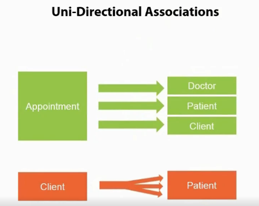

## 9. Value Object

- Mide, cuantifica o describe una cosa del dominio
- La identidad está basada en la composición de valores
- Inmutable
- Comparable usando todos sus valores
- No tiene efectos colaterales

Un ejemplo sería un String (en java, por ejemplo). Es una combinación de caracteres, inmutable.

Otro ejemplo sería el valor de una compañia en bolsa: 50.000 $ (la combinación del número y la moneda).

Otro sería por ejemplo un intervalo de fechas (con fecha desde y fecha hasta como valores).

Se recomienda usar Value Objects en lugar de Entidades siempre que sea posible.

Los value object también pueden tener sus métodos y su lógica. De hecho es mejor ponerlos ahí que directamente en las entidades que los utilicen.

## 10. Domain Service

Cuando las operaciones van a afectar a más de una entidad, se pueden concentrar en los Domain Services.

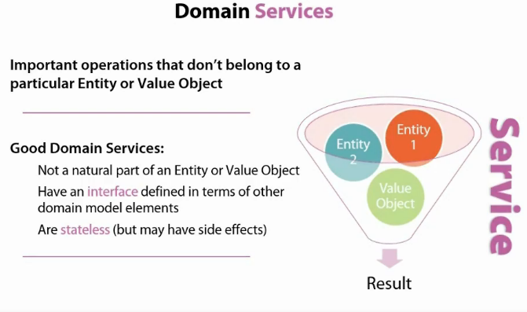

Ejemplos de servicios en diferentes capas

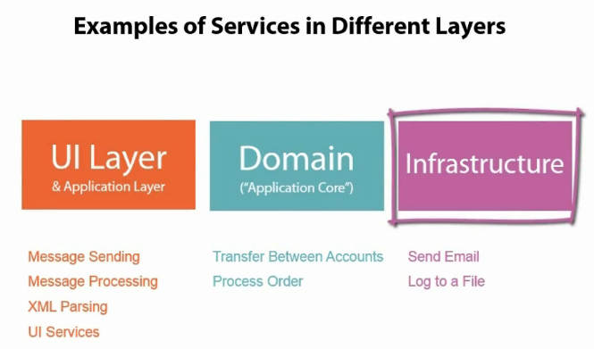

## 11. Como tratar la complejidad en DDD

Ya hemos visto como limitar la complejidad limitando las relaciones a que sean unidireccionales. 

### 11.1 Aggregates y Aggregate root

Otra forma es usar __aggregates__ y __aggregate roots__

Los aggregates son agrupaciones de entidades y value objects que trabajan juntos y cambian conjuntamente. 

Eric Evans lo define como un conjunto de objetos asociados que trataremos como una unidad para el propósito de hacer cambios en ella.

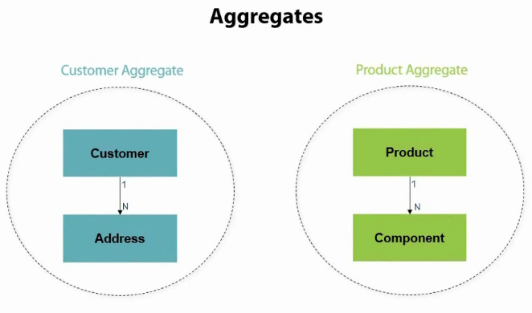

Los componentes del Aggregate seguirán el patrón ACID:

- Atomic
- Consistent
- Isolated
- Durable

Es responsabilidad del Aggregate Root mantener la consistencia de todo.

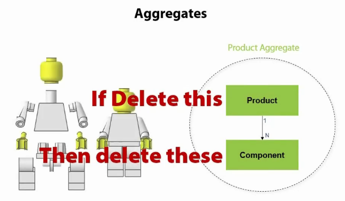

Relaciones entre los agregados

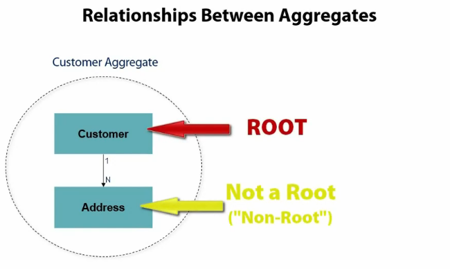

Aggregate-Relationships.png

Se tienen que relacionar entre ellos usando los Aggregate Roots.

Diseño partiendo de un Aggregate Root.

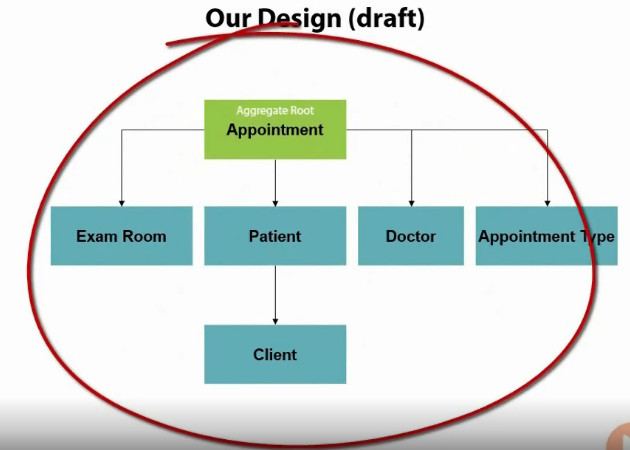

### 11.2 Invariants

Son valores que no pueden modificarse, como por ejemplo la velocidad de la luz, el número máximo de objetos que pueden ponerse en un carrito de la compra, o que la fecha de fin ha de ser mayor o igual que la fecha de inicio.

Cuando dependen de otros objetos, como por ejemplo el número máximo de objetos del carrito de la compra, se consideran __Aggregate Invariants__.

Revisando nuestro diseño

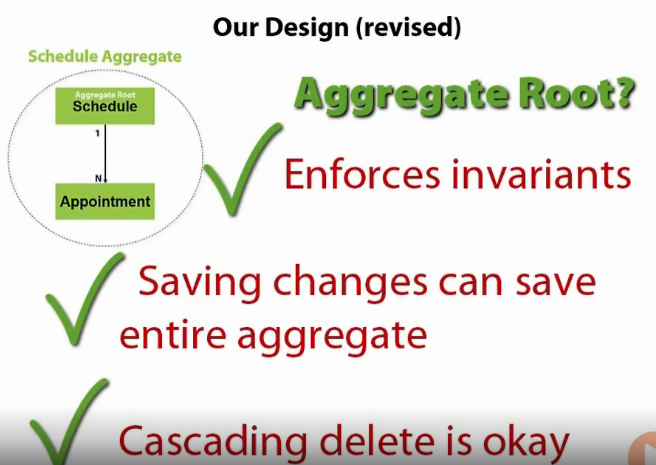

### 11.3 Resumen de los agregados

- Los agregados se usan para intentar reducir la complejidad
- No siempre son la solución
- Sólo se pueden conectar mediante el root
- No pases por alto el uso de FKs para entidades no root. El uso de demasiadas FK hacia entidades no raíz puede sugerir que hay un problema de diseño.
- Agregados de una sola entidad pueden ser aceptables
- Usa la regla de borrado en cascada

### 11.4 Sumario

Agreggate: un grafo transaccional de objetos

Aggregate Root: El punto de entrada que asegura la integridad de todo el grafo

Invariant: Una condición que siempre debe cumplirse para asegurar la consistencia del sistema.

Persistance Ignorant Classes: Clases que no tienen conocimiento de cómo son persistidas.

## 12. Repositories

Se debe trabajar a partir de los aggregate Roots, para mantener la consistencia.

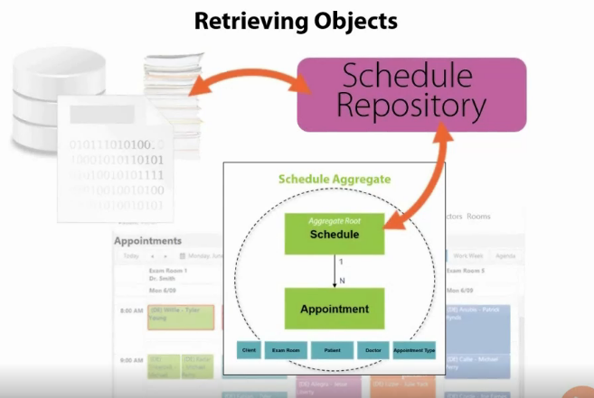

Ciclo de vida de los objectos sin repositorio y con repositorio

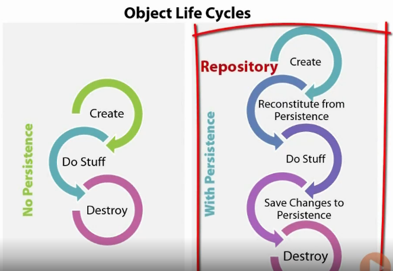

Según eric Evans, un repositorio representa todos los objectos de un cierto tipo como un conjunto conceptual. Cómo una colección con una capacidad de consulta más elaborada.

### 12.1 Aspectos importantes a tener en cuenta

- Pensar en el como si fuera una colección en memoria
- Implementar un conjunto de métodos estandar: getById, add, remove, update and list (por ejemplo)
- Necesitamos métodos para añadir y eliminar
- Necesitamos métodos para obtener un conjunto determinado mediante un criterio de selección.
- Neceistamos repositorios para los Aggregrate Roots.
- Mientras que el cliente se centra en el modelo, el repositorio se centra en la persistencia.

### 12.2 Beneficios

- Abstracción común para la persistencia
- Proporciona separación de responsabilidades
- Comunica las decisiones de diseño 
- Facilita la testeabilidad
- Facilita el mantenimiento

Es importante que el código de la aplicación clinete puede ignorar la implementación real del repositorio, pero los desarrolladores no pueden.

### 12.3 Errores comunes

- N+1 Query errors: una consulta para obtener la lista y otra para obtener cada individuo
- Uso inadecuado de carga perezosa o prematura
- Obtención de más datos de los que realmente se necesitan

### 12.4 Repositorios vs Factorias

- Las factorias crean nuevos objectos
- Los repositorios obtienen y actualizan los objectos existentes
- Un repositorio puede usar una Factoría para crear sus objetos
- Las factorías NO tienen persistencia, los Repositorios SÍ.

### 12.5 Repositorios Genéricos

No son buena idea, ya que una aplicación cliente podría trabajar con repositorios fuera de los Aggregate Roots, perdiendo así consistencia la aplicación. Hay que tener cuidado en la forma de implementarlos. Solo los implementaremos en los Aggregate Root.

### 12.5 Resumen

- Repositorio: Una clase que encapsula la persistencia de datos de un Aggregate Root
- ACID (Atomic, Consistent, Isolated and Durable)

## 13. Domain Events & Anti-Corruption Layers

Los Domain Events se usan para comunicar cambios de un Dominio a otro.
Los Domain Events deben ser parte del lenguaje Ubiquo.

Los Domain Events representan algo que ha ocurrido
Son inmutables

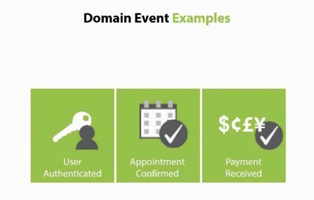

### 13.1 Diseñando los Domain Events

- Cada evento en su propia clase
- Incluye un timestamp que nos indique cuando se produjo
- Captura los detalles específicos del evento
    * Qué necesitamos saber para volver a lanzar el evento otra vez
    * Considera incluir las identidades de cualquier agregado involucrato en el evento

- Los campos del evento son inicializados en el constructor
- No tienen ni comportamiento ni efectos colaterales

Gracias a la comunicación por eventos, el servidor podría comunicarse directamente con el Cliente Web.

### 13.2 Domain Event Boundaries

- Crear eventos separados para clientes específicos
- Crear eventos cross-system para clientes externos
- Crear eventos específicos para la capa de UI

### 13.3 Anti Corruption Layer

Traduce sistemas externos al nuestro usando patrones de diseño como Facade, Adapter o Custom Translation.

También sirve para comunicarse entre varios Contextos.

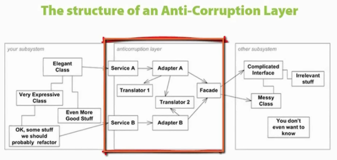

### 13.4 Resumen

Domain Event: Una clase que captura la ocurrencia de un evento en un objeto de dominio.

Hollywood Principle: Don't call us, we'll call you

Inversion of Control (IOC): Un patrón para acoplar debilmente un objeto dependiente de un objeto que necesitará en tiempo de ejecución.

Anti-Corruption Layer: Funcionalidad que aisla un bounded context y maneja la interación con sistemas externos u otros contextos.

## 14. Uso de los beneficios de DDD

Repaso del diseño que hemos aplicado al ejemplo de la Clínica Veterinaria:

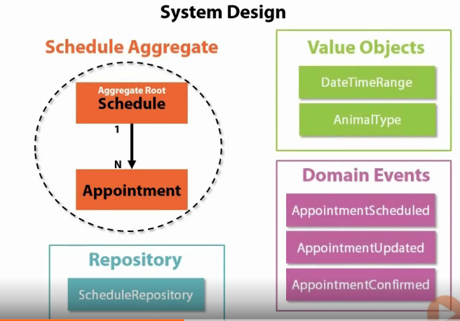

### 14.1 Introducción de una cola de mensajería

Gracias al uso de los eventos, tenemos fácil introducir una cola de mensajería.

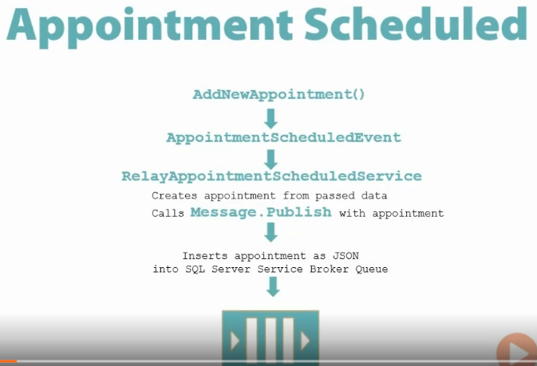

Es muy interesante usarlas para pasarse mensjaes entre varias aplicaciones.

A veces necesitamos más flexibilidad, y se usa un Service Bus. El Service Bus iría a más alto nivel de un Message Queue, y su responsabilidad es que los mensajes sean entregados.

La gran diferencia entre los dos, es que QUEUE MESSAGE usa FIFO para la entrega de los mensajes (a una o varias aplicaciones). Un Message Bus puede ser implementado de varias formas.

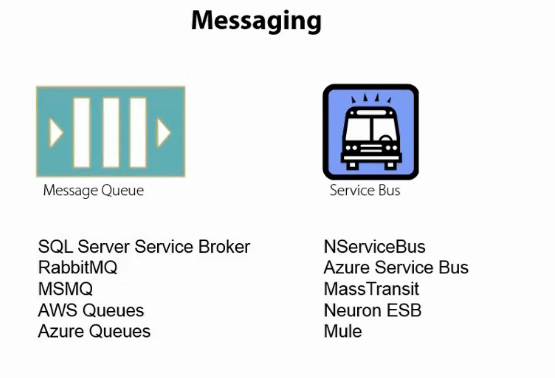

### 14.2 Considerar el UI como parte del Domain Design

No se trata de un antipatrón.
Se trata de hablar del UI en las fases tempranas del diseño, ya que muchas veces va a afectar a como hay que implementar la aplicación.

### 14.3 La falacia del perfeccionismo

Todo lo que se ha comentado aquí se trata de una guía, y ya seremos nosotros quienes mediante el sentido común aplicaremos lo que veamos conveniente o no.

Según Eric Evans, ningún modelo es perfecto. Los modelos están para resolver los problemas. Si un modelo no los resuelve, es mejor no usarlo.

### 14.4 Resumen

__Message Queue__: Es una herramienta para almacenar y recuperar mensajes, a menudo usada por las aplicaciones para comunicarse con otras de una forma desacoplada.

__Service Bus__: Es el software responsable de gestionar como los mensajes son enrutados hacia las aplicaciones y/o servicios. Un Service Bus permite que una aplicación se suscriba a los eventos que necesita, y por otro lado las aplicaciones, pueden lanzar eventos hacia el Service Bus.

