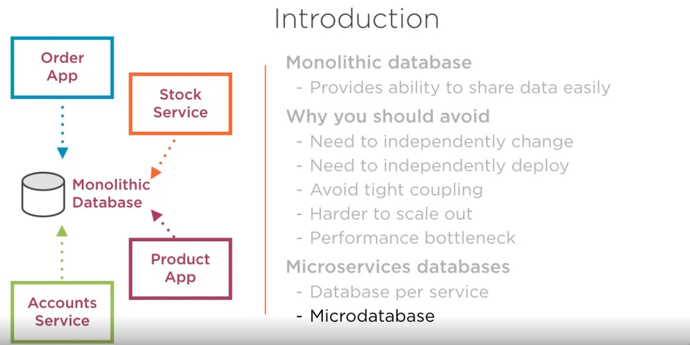
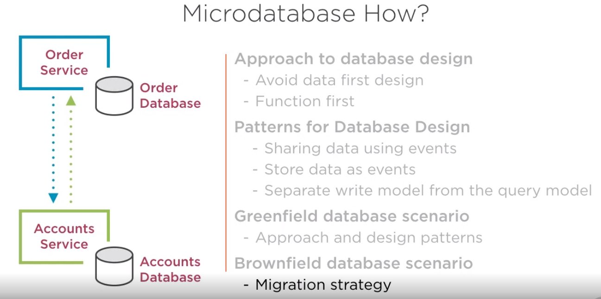

# Microservices Architectural Design

## 1. Resumen

## 2. How to Scope microservices using bounded contexts

### 2.1 Ideas principales

La idea de los microservicios es que permitan desarrollar software que miminice el coste de modificación y tiempo de entrega.

Design vs Scrumm. Aquí la idea es que la arquitectura interna de los microservicios ha de ser emergente, y que realmente se haga durante el proceso de desarrollo. Inicialmente nos quedamos con que se necesita una especificación funcional de lo que queramos que haga el microservicio.

Es responsabilidad de arquitectos del equipo comunicar al equipo para que se van a usar estos microservicios, usando un punto de vista estrátegico de la función que realizan.

Usaremos los contextos delimitados para definir la arquitectura de microservicios de la aplicación. Estos contextos vienen de usar DDD (Domain Driven Design) de Eric Evans.

### 2.2 Domain Driven Design

Nos centraremos en el concepto de bounded contexts.

### 2.3. Bounded Context

### 2.4 Ubiquituous Language

El lenguaje ubiquo pertenece a una funcionalidad específica (bounded context). Se usa por todos los miembros del equipo para conectar todas las actividades que se realicen con el software.

### 2.5 Aproximación a los microservicios sin bounded contexts

Se recogen los aspectos core de nuestro dominio:

Se desarrollan los conceptos core del negocio con otros conceptos asociados.

Si no tenemos cuidado, acabamos solapando los conceptos y se queda todo muy liado.

Al no haber delimitaciones entre los diferentes contextos, la aplicación se volverá muy complicada de mantener a lo largo del tiempo, e incluso en la fase de desarrollo y evolutivos.

### 2.6 Uso de bounded contexts

Lo primero, es identificar el core.

El Core define el lenguaje Ubicuo

Renombramos los conceptos

Podemos sacar algunos conceptos complejos de los contextos

De esta forma, nos quedamos con conceptos más simples, lo que implica mejor integración

De esta forma, el pasar del bounded context a los microservicios, se hace de forma rápida y clara

Microservicios que finalmente resultan

### 2.7 Agregación

Cuando interesa descomponer o agregar? Hay que verlo en función de las necesidades

## 3. Como concebir la arquitectura de microservicios asíncronos

Event based:

 - Competing Workers Pattern
 - Fanout pattern

Async API Calls

  - Request/Acknowledge with Callback

### 3.1 Asynchronous Microservices

Introducción

Opciones que tenemos

- Event based
- Async API Calls
- Hangfire

### 3.2 Event Based

Event as a message

Uno de los más populares es Rabbit.

### 3.3 Competing Workers Pattern

Lo proporcionan los message brokers y permite escalar horizontalmente nuestra arquitectura en caso de que aumenten nuestras necesidades.

Además proporiona redundancia en caso de fallo.

Aquí tenemos un ejemplo de immplemetanción con rabbit mq

### 3.3 Fanout Pattern

Con este patrón, el mensjae es consumido por todos los servicios.

Ejemplo de implementación con rabbit mq

### 3.4 Api Async Pattern

Se comunican directamente de forma asíncrona, sin usar un broker de mensajería.

Ejemplo completo de Request/Acknowledge con Callback

Detalle

## 4. Api Microservices

- Functional Requirements
- Architecture Options
- REST Architectural Style
- API Architectural Patterns
    * Facade Design Pattern
    * Proxy Design Pattern
    * Stateless Service Pattern

### 4.1 Introduction

### 4.2 Functional Requirements

### 4.3 Architecture Options

### 4.4 REST Architectural Style

### 4.5 Applying REST Constraints to Microservices

### 4.6 RESTful API Example

### 4.7 Pragmatic RESTful microservices

### 4.8 API Architectural Patterns

__Facade Design Pattern__

Un ejemplo de facade serían los típicos controllers que sirven para aislar la lógica de negocio del API REST.

Pasos a seguir

__Proxy Design Pattern__

__Stateless Service Pattern__

## 5. How to Compose Microservices

Introduction
Patterns
- Broker
- Aggregate
- Chained
- Proxy
- Branch

### 5.1 Introduction

### 5.2 Broker Composition Pattern

Aquí la idea básica a tener en cuenta es que una vez lanzado por el API el mensaje hacia el message broker y que sea recogido por este, se devuelve el resultado, sin necesidad de que se procese por los servicios.

Esto permite que la aplicación de frontend no tenga que esperar al procesado.

### 5.3 Aggregate Composition Pattern

En este ejemplo el Aggregator es la Web App, que consume datos de varios servicios para componer el resultado que necesita.

En este otro ejemplo, tenemos un agregador desacoplado de la Web App. Si el proceso de la agregación de los datos lleva algún tiempo, es preferible utilizar una comunicación asíncrona para llamar al servicio de Agregación y obtener el resultado mediante __callback address pattern__. Esto lo hemos visto en el capítulo de llamadas asíncronas a microservicios.

### 5.4 Chained Composition Pattern

Es un patrón muy común. Consiste en que los servicios se van llamando sucesivamente de forma secuencial. Si se encadenan demasiados servicios de forma asíncrona o estos tardan bastante tiempo en responder, puede retrasar demasiado la respuesta. Se recomienda que las cadenas no sean demasiado largas ni lentas. En ese caso, se recomienda usar alguno de los otros patrones que hemos visto para descomponer la composición en cadena y también por supuesto, la comunicación asíncrona.

### 5.5 Proxy Composition Pattern

Especialmente útil cuando necesitamos exponer nuestros servicios hacia el exterior. Así sólo exponemos un único servicio.

### 5.6 Branch Composition Pattern

Nos permite ejecutar una o varias tareas en backgroung simultaneamente, cada una de ellas usando un patrón diferente en función de la necesidad. En el ejemplo, el service Two se ejecuta de forma asíncrona, mientras que el Service One A, de forma síncrona.

## 6. How to Achieve Data Consistency Across Microservices

### 6.1 Summary

- Introduction
- Options
- Two Phase Commit
- Saga Pattern
- Eventual Consistency

### 6.1 Introduction

Data Consistency: Hay que mantener la consistencia de los datos en caso de que las operaciones se completen de forma correcta o alguna haya fallado.

En una arquitectura tradicional de una aplicación monolítica el mecanismo habitual suele usare el mecanismo de transacciones.

En una arquitectura de microservicios, con una arquitectura distribuida, necesitamos portar este concepto a este nuevo estilo con los datos distribuidos y asociados a distintos microservicios.

### 6.2 Options

Traditional ACID Transactions:

- Atomicity: La transacción se ejecuta de forma completa o no se ejecuta
- Consistency: La transacción no puede dejar al sistema en un estado intermedio
- Isolation: La transacción se ejecuta de forma aislada sin tener en cuenta la ejecución simultánea o secuencial de otras transacciones
- Durability: Una vez ejecutada la transacción, permanece en el sistema.

Two Phase commit pattern
- ACID
- CAP Theorem (Choosing Consistency)

Saga Pattern
- Cambia la atomicidad por la disponibilidad

Eventual consistency pattern
- Compromete ACID
- CAP Theorem (Choosing Availability)

### 6.3 Two Phase Commit

Prepare Phase

Vote Phase

Commit Phase

Inconvenientes

Actualmente se considera un antipatrón porque conlleva problemas de escalado y reduce el rendimiento del sistema.

Si lo usamos, usarlo a pequeña escala. Aunque es mejor recurrir a las alternativas siguientes:

- Saga pattern
- Eventual Consistency

### 6.4 Saga Pattern

En este ejemplo Exitoso, podemos apreciar el Saga Log y el SEC (Saga Execution Coordinator)

Otro ejemplo, en este caso Fallido.

Implementación

### 6.5 Eventual Consistency

Está basado en el modelo "BASE", que viene a decir que no tenemos que ejecutar las actualizaciones inmediatamente, sino que se acabarán realizando a lo largo del tiempo.

Promueve la disponibilidad frente a la consistencia del modelo ACID.

Se puede usar la replicación de datos (tradicionalmente se usaba esto) y en microservicios se usa Event Based.

## 7. How to Centralize Access to Microservices using an API Gateway

### 7.2 Introduction

- API Gateway
- Kong API Gateway

Ejemplos sin el uso de Api Gateway

Un Api Gateway nos ayuda a reducir enormemente la complejidad de los servicios que son vistos desde fuera tanto por las aplicaciones moviles consumidoras como por clientes externos a nuestros microservicios.

### 7.3 Api GateWay Solution

### 7.4 Api GateWay Example

### 7.5 Kong Api Gateway

Es un Api Gateway de software libre

Tiene varios plugins que podemos aplicar para centralizar la forma de autenticarnos.

Podemos tener blacklist de usuarios, plugins relacionados con el control del tráfico, caché, logging, etc.

También tiene políticas de reintento

Vale mucho la pena echar un vistazo.

## 8. Como descomponer bases de datos monolíticas a lo largo de microservicios

### 8.1 Introduction

### 8.2 Microdatabases

### 8.3 Approach to Database Design

### 8.4 Patterns for Database Design

#### 8.4.1 Event Driven

#### 8.4.1 Event Sourcing

Viendo el ejemplo, en el event notification, se pasa solo la modificación realizada, no el estado completo del activo que se ha modificado.

#### 8.4.1 CQRS

Usamos dos bases de datos distintas, una para actualizaciones y otra para consultas. Confiamos esta solución a que nos sirve la consistencia eventual y en la correcta sincronización de las dos bases de datos.

### 8.5 Greenfield Database Approach

### 8.6 Brownfield Database Approach

## 9. How to make microservices more resilient

### 9.1 Introduction

- Patterns and approach
- Design Patterns
- Approach to Design

### 9.2 Timeouts Design Pattern

Consiste en devlver una excepción en caso de que venga el timeout en lugar de quedarse esperando a que responda el servicio que está fallando.

Se minimiza el riesgo de sobrecargar el servicio, pero no desaparece del todo.

### 9.3 Circuit Breaker Design Pattern

Se usa en adición al timeout. Es similar a abrir un circuito eléctrico. Cuando se detecte un fallo, se previene la llamada al servicio que lo provoca.

El Circuit Breaker monitoriza los fallos que se están produciendo y si supera un umbral, abre el circuito y devuelve un error directamente en lugar de seguir haciendo llamadas.

Hemos llegado al umbral de tolerancia definido y se abre el circuito.

Existe otro umbral para poder abrir el circuito

Se lanza una llamada para ver si va bien, y en ese caso, se vuelve a cerrar

### 9.4 Retry Design Pattern

Tenemos librerías que implementan los tres patrones: timeout, circuit breaker y retry.

### 9.5 Bulkheads Design Pattern

Patrón de alto nivel, es una forma de sellar el fallo, como harían los mamparos de un barco, evitando fallos en cascada.

En este caso, tenemos un mismo punto de fallo para una aplicación con demanda normal y otra con mucha demanda

Usando este patrón, separamos las aplicaciones mejor, para que en caso de fallo de una, no se vea afectada la otra.

Otro ejemplo consiste en aislar los microservicios

También se puede aplicar la redundancia

Podemos aplicar un balanceador de carga o un message broker

### 9.6 Making a Resilient Microservices Architecture

## 10. Compatibilidad de los servicios hacia atrás

### 10.1 Compatible Changes

### 10.2 Adaptor Design Pattern

### 10.3 Testing Compatibility

### 10.4 Versioning Strategies

## 11 Como definir y documentar microservicios

Swagger (Open API) es una de las mejores formas de documentar nuestras APIS, a la vez que ofrecemos un enfoque Api FIRST par la definición de los contratos de nuestros servicios.

## 12. Como implementar un logging centralizado en nuestros microservicios

### 12.1 Introduction

- Centralized Logging
- Consistent Logging Format
- Logging Levels
- Transaction Transparency
- Centralized Logging Demo

### 12.2 Centralized Logging

Como ejemplo se usa Elastic Search and Kibana con logstash a modo de log centralizado.

## 13.Como proporcionar Informes de los datos en microservicios

Tenemos api de reporting a modo de batch para ir construyendo los informes. Además, así no mezclamos con la operativa principal. Para evitar el antipatrón de tener una misma base de datos, se puede usar CQRS con una copia de los datos.

Esta aproximación es válida para pequeños reportes y pequeñas cantidades de datos.

Se puede mejorar el rendimiento añadiendo una base de datos para el Reporting Service Tool

Usando Data Push Application, transformamos los datos en otro formato más conveniente hacia una base de datos que será consumida por la aplicación de Reportes. La desventaja es que ahora tenemos otra aplicación más y acoplada a una base de datos central de la que tiran varios servicios.

Se puede mejorar usando CQRS o bien asesgurar que el equipo del API y de la aplicación de Push está gestionada y mantenida por el mismo equipo de desarrollo.

Esta aproximacion es barata y totalmente desacoplada del funcionamiento de la aplicación.

## 14. Como automatizar microservicos on-promise (sistemas in-house)

