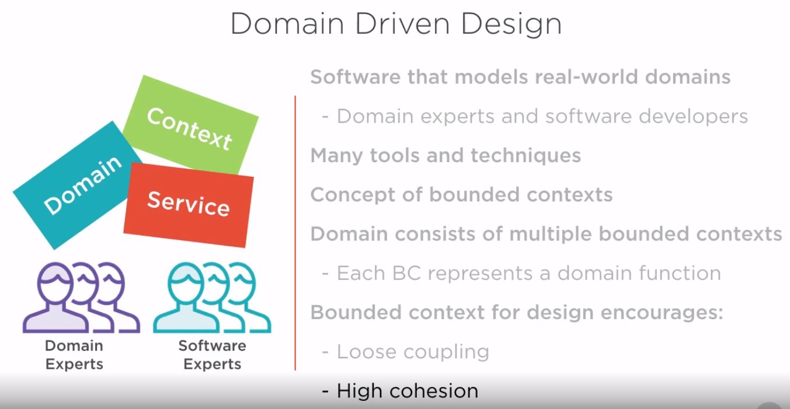

# Microservices Architectural Design

## 1. Resumen

## 2. How to Scope microservices using bounded contexts

### 2.1 Ideas principales

La idea de los microservicios es que permitan desarrollar software que miminice el coste de modificación y tiempo de entrega.

Design vs Scrumm. Aquí la idea es que la arquitectura interna de los microservicios ha de ser emergente, y que realmente se haga durante el proceso de desarrollo. Inicialmente nos quedamos con que se necesita una especificación funcional de lo que queramos que haga el microservicio.

Es responsabilidad de arquitectos del equipo comunicar al equipo para que se van a usar estos microservicios, usando un punto de vista estrátegico de la función que realizan.

Usaremos los contextos delimitados para definir la arquitectura de microservicios de la aplicación. Estos contextos vienen de usar DDD (Domain Driven Design) de Eric Evans.

### 2.2 Domain Driven Design

Nos centraremos en el concepto de bounded contexts.

### 2.3. Bounded Context

### 2.4 Ubiquituous Language

El lenguaje ubiquo pertenece a una funcionalidad específica (bounded context). Se usa por todos los miembros del equipo para conectar todas las actividades que se realicen con el software.

### 2.5 Aproximación a los microservicios sin bounded contexts

Se recogen los aspectos core de nuestro dominio:

Se desarrollan los conceptos core del negocio con otros conceptos asociados.

Si no tenemos cuidado, acabamos solapando los conceptos y se queda todo muy liado.

Al no haber delimitaciones entre los diferentes contextos, la aplicación se volverá muy complicada de mantener a lo largo del tiempo, e incluso en la fase de desarrollo y evolutivos.

### 2.6 Uso de bounded contexts

Lo primero, es identificar el core.

El Core define el lenguaje Ubicuo

Renombramos los conceptos

Podemos sacar algunos conceptos complejos de los contextos

De esta forma, nos quedamos con conceptos más simples, lo que implica mejor integración

De esta forma, el pasar del bounded context a los microservicios, se hace de forma rápida y clara

Microservicios que finalmente resultan

### 2.7 Agregación

Cuando interesa descomponer o agregar? Hay que verlo en función de las necesidades

## 3. Como concebir la arquitectura de microservicios asíncronos

Event based:

 - Competing Workers Pattern
 - Fanout pattern

Async API Calls

  - Request/Acknowledge with Callback

### 3.1 Asynchronous Microservices

Introducción

Opciones que tenemos

- Event based
- Async API Calls
- Hangfire

### 3.2 Event Based

Event as a message

Uno de los más populares es Rabbit.

### 3.3 Competing Workers Pattern

Lo proporcionan los message brokers y permite escalar horizontalmente nuestra arquitectura en caso de que aumenten nuestras necesidades.

Además proporiona redundancia en caso de fallo.

Aquí tenemos un ejemplo de immplemetanción con rabbit mq

### 3.3 Fanout Pattern

Con este patrón, el mensjae es consumido por todos los servicios.

Ejemplo de implementación con rabbit mq

### 3.4 Api Async Pattern

Se comunican directamente de forma asíncrona, sin usar un broker de mensajería.

Ejemplo completo de Request/Acknowledge con Callback

Detalle

## 4. Api Microservices

- Functional Requirements
- Architecture Options
- REST Architectural Style
- API Architectural Patterns
    * Facade Design Pattern
    * Proxy Design Pattern
    * Stateless Service Pattern

### 4.1 Introduction

### 4.2 Functional Requirements

### 4.3 Architecture Options

### 4.4 REST Architectural Style

### 4.5 Applying REST Constraints to Microservices

### 4.6 RESTful API Example

### 4.7 Pragmatic RESTful microservices

### 4.8 API Architectural Patterns

__Facade Design Pattern__

Un ejemplo de facade serían los típicos controllers que sirven para aislar la lógica de negocio del API REST.

Pasos a seguir

__Proxy Design Pattern__

__Stateless Service Pattern__

## 5. How to Compose Microservices

Introduction
Patterns
- Broker
- Aggregate
- Chained
- Proxy
- Branch

### 5.1 Introduction

### 5.2 Broker Composition Pattern

Aquí la idea básica a tener en cuenta es que una vez lanzado por el API el mensaje hacia el message broker y que sea recogido por este, se devuelve el resultado, sin necesidad de que se procese por los servicios.

Esto permite que la aplicación de frontend no tenga que esperar al procesado.

### 5.3 Aggregate Composition Pattern

En este ejemplo el Aggregator es la Web App, que consume datos de varios servicios para componer el resultado que necesita.

En este otro ejemplo, tenemos un agregador desacoplado de la Web App. Si el proceso de la agregación de los datos lleva algún tiempo, es preferible utilizar una comunicación asíncrona para llamar al servicio de Agregación y obtener el resultado mediante __callback address pattern__. Esto lo hemos visto en el capítulo de llamadas asíncronas a microservicios.

### 5.4 Chained Composition Pattern

Es un patrón muy común. Consiste en que los servicios se van llamando sucesivamente de forma secuencial. Si se encadenan demasiados servicios de forma asíncrona o estos tardan bastante tiempo en responder, puede retrasar demasiado la respuesta. Se recomienda que las cadenas no sean demasiado largas ni lentas. En ese caso, se recomienda usar alguno de los otros patrones que hemos visto para descomponer la composición en cadena y también por supuesto, la comunicación asíncrona.

### 5.5 Proxy Composition Pattern

Especialmente útil cuando necesitamos exponer nuestros servicios hacia el exterior. Así sólo exponemos un único servicio.

### 5.6 Branch Composition Pattern

Nos permite ejecutar una o varias tareas en backgroung simultaneamente, cada una de ellas usando un patrón diferente en función de la necesidad. En el ejemplo, el service Two se ejecuta de forma asíncrona, mientras que el Service One A, de forma síncrona.

## 6. How to Achieve Data Consistency Across Microservices

### 6.1 Summary

- Introduction
- Options
- Two Phase Commit
- Saga Pattern
- Eventual Consistency

### 6.1 Introduction

Data Consistency: Hay que mantener la consistencia de los datos en caso de que las operaciones se completen de forma correcta o alguna haya fallado.

En una arquitectura tradicional de una aplicación monolítica el mecanismo habitual suele usare el mecanismo de transacciones.

En una arquitectura de microservicios, con una arquitectura distribuida, necesitamos portar este concepto a este nuevo estilo con los datos distribuidos y asociados a distintos microservicios.

### 6.2 Options

Traditional ACID Transactions:

- Atomicity: La transacción se ejecuta de forma completa o no se ejecuta
- Consistency: La transacción no puede dejar al sistema en un estado intermedio
- Isolation: La transacción se ejecuta de forma aislada sin tener en cuenta la ejecución simultánea o secuencial de otras transacciones
- Durability: Una vez ejecutada la transacción, permanece en el sistema.

Two Phase commit pattern
- ACID
- CAP Theorem (Choosing Consistency)

Saga Pattern
- Cambia la atomicidad por la disponibilidad

Eventual consistency pattern
- Compromete ACID
- CAP Theorem (Choosing Availability)

### 6.3 Two Phase Commit

Prepare Phase

Vote Phase

Commit Phase

Inconvenientes

Actualmente se considera un antipatrón porque conlleva problemas de escalado y reduce el rendimiento del sistema.

Si lo usamos, usarlo a pequeña escala. Aunque es mejor recurrir a las alternativas siguientes:

- Saga pattern
- Eventual Consistency

### 6.4 Saga Pattern

En este ejemplo Exitoso, podemos apreciar el Saga Log y el SEC (Saga Execution Coordinator)

Otro ejemplo, en este caso Fallido.

Implementación

### 6.5 Eventual Consistency

Está basado en el modelo "BASE", que viene a decir que no tenemos que ejecutar las actualizaciones inmediatamente, sino que se acabarán realizando a lo largo del tiempo.

Promueve la disponibilidad frente a la consistencia del modelo ACID.

Se puede usar la replicación de datos (tradicionalmente se usaba esto) y en microservicios se usa Event Based.

## 7. How to Centralize Access to Microservices using an API Gateway

